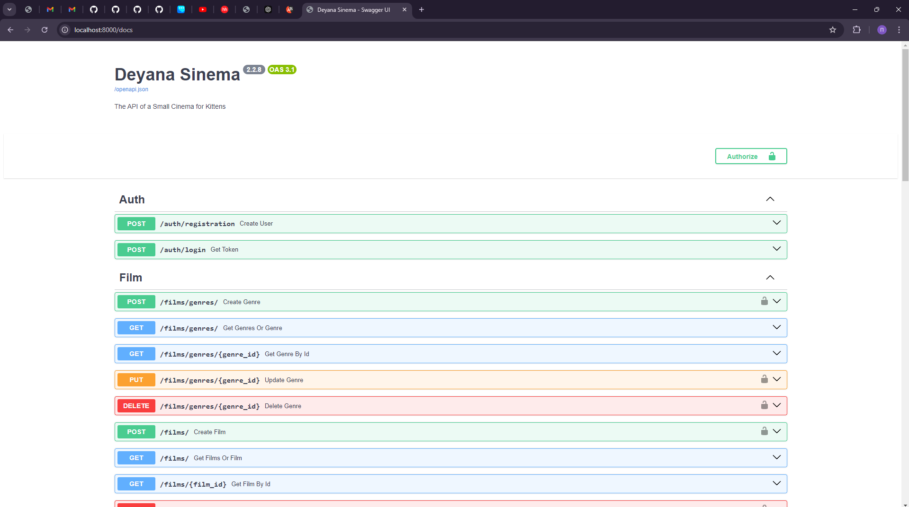

# Регистрация

## 1. Создание первого роутера

Роутер - это способ организации и маршрутизации HTTP-запросов в приложении. Он используется для обработки запросов по определенным URL-адресам и назначения их соответствующим функциям, которые будут выполняться, когда пользователь обращается к этому адресу

В папке `api` создадим папку `auth`, а в ней создадим файл `router.py`. Добавим туда следующий код:

```python
from fastapi import Depends, APIRouter
from fastapi.responses import JSONResponse
from sqlalchemy.ext.asyncio import AsyncSession

from ..database import get_session
from ..user.schemes import UserCreate

router = APIRouter(prefix="/auth")

@router.post("/registration", response_class=JSONResponse)
async def create_user(
    user_create: UserCreate, 
    session: AsyncSession = Depends(get_session)
):
    pass
```

- `APIRouter(prefix="/auth")` - объявление роутера с префиксом, т.е все его ендпоинты будут иметь URL как минимум /auth/...
- `@router.post` - декоратор роутера с маршрутом POST (Добавление)
- `"/registration"` - эндпоинт регистрации
- `response_class/response_model` - сериализатор данных (Иcпользуется для придачи возвращаемым данным определённой одинаковой структуры, т.е сериализации)
- `user_create: UserCreate` - объект, с данными для регистрации. Позже мы перейдем к созданию этой схемы
- `session: AsyncSession = Depends(get_session)` - получение сессии для подключения к БД при помощи метода `Depends`
- `pass` - заглушка, чтоб не светилась ошибка, можно использовать как в `if` так и в циклах

## 2. Создание первой схемы

Для сериализации мы будем использовать Pydantic схемы -  это классы, которые используются для валидации данных и приведения типов. Эти схемы основаны на моделях Pydantic и позволяют автоматически проверять данные, которые передаются через запросы (например, параметры тела запроса или параметры URL). Они помогают гарантировать, что данные имеют правильный формат и соответствуют заданным правилам, прежде чем использовать их в приложении.

В папке `user` создадим файл `schemes.py` и добавим в него следующий код:

```python
from pydantic import BaseModel

class UserCreate(BaseModel):
    username: str
    password: str
    confirm_password: str
    full_name: str
```

Теперь у нас схема для создания пользователя. Здесь указан самый простой вариант схемы, где у всех ее полей тип данных простой str, но нам ничего не мешает использовать как типы данных из `typing`, модели, так и другие схемы или например `datetime`. В дальнейшем вы с таким ознакомитесь.

Создайте сами схему для сериализации `User` и назовите её `BaseUser`. Просто добавите в нее те поля, которые вы хотите видеть при возвращении пользователя API. У меня она выглядит вот так:

```python
class BaseUser(BaseModel):
    id: int
    username: str
    role: str
    full_name: str
```

И давайте добавим схему для ответа `UserResponse`
```python
class UserResponse(BaseModel):
    message: str
    user: BaseUser
```
Как можете увидеть `user` у нас является `BaseUser`


## 3. Создание первого запроса к БД

Запросы к БД мы будем хранить в файлах `queries.py`, по этому создадим такой в папке `auth` и создадим там следующую функцию

```python
from sqlalchemy.ext.asyncio import AsyncSession
from ..user.models import User
from ..user.schemes import UserCreate, BaseUser

async def registration_user(session: AsyncSession, user_create: UserCreate) -> BaseUser:
    user = User(username=user_create.username, full_name=user_create.full_name)
    await user.set_password(user_create.password)
    session.add(user)
    await session.commit()
    await session.refresh(user)

    return BaseUser(
        id=user.id,
        username=user.username,
        role=user.role.value,
        full_name=user.full_name,
    )
```

В этой функции мы создаем объект `user:User` при помощи `username` и `full_name`, добавляем хешированный пароль в объект. После добавляем изменения в сессию, коммитим их в БД и назад возвращаем объект (Этот объект уже будет иметь все поля, пока первый имеет только `username`, `full_name` и `hashed_password`, этот вялется объектом, который вернулся после создания уже из БД, включая и роль, которая сгенерировалась дефолтно и `id`), возвращаем же мы наш `BaseUser`

!!! tip
    `await user.set_password(user_create.password)` - это асинхронная функция объекта `User`, давайте определим ее внутри класса

    ```python
    class User(Base):
    __tablename__ = "users"

    id = Column(Integer, primary_key=True)
    username = Column(String(20), unique=True, nullable=False)
    hashed_password = Column(String(512), nullable=False)
    role = Column(Enum(Role), default=Role.USER, nullable=False)
    full_name = Column(String(40), nullable=False)

    async def set_password(self, password: str) -> None:
        self.hashed_password = bcrypt.hashpw(
            password.encode("utf-8"), bcrypt.gensalt()
        ).decode("utf-8")
    ```
    Теперь наш класс имеет вот такой вид

    Описание функции:
    - `async def`: Это асинхронная функция, которая позволяет запускать её параллельно с другими асинхронными операциями, не блокируя основное выполнение программы.
    - `self`: Ссылка на экземпляр класса (метод явно принадлежит какому-то классу, вероятно, это модель пользователя).
    - `password`: str: Метод принимает один параметр — пароль, который представляет собой строку.
    - `-> None`: Метод не возвращает никакого значения (возвращаемый тип None).
    - `self.hashed_password` - поле в модели `User`
    `password.encode("utf-8")`: Пароль, который был передан в функцию, преобразуется в байтовую строку (так как библиотека `bcrypt` работает с байтами, а не с обычными строками).
    - `bcrypt.gensalt()`: Генерирует "соль" — случайную строку, которая добавляется к паролю перед хешированием. Это делается для защиты от атак с использованием заранее подготовленных хеш-таблиц (так называемых "радужных таблиц").
    - `bcrypt.hashpw`: Выполняет хеширование пароля с использованием алгоритма `bcrypt` и добавленной соли. Результатом является безопасный хеш пароля.
    - `.decode("utf-8")`: Хеш пароля, который был получен на предыдущем шаге, преобразуется обратно из байтового формата в строковый, чтобы его можно было сохранить в базе данных в виде строки.

!!! warning
    Попрошу заметить, что все асинхронные функции (`async def...`) вызываются при помощи `await`. Почему же? Все асинхронные функции в Python, которые определяются с помощью `async def`, возвращают корутину (`coroutine`) вместо немедленного результата. Чтобы получить результат выполнения такой функции, мы используем оператор `await`

    ##### Что такое асинхронное программирование?
    Асинхронное программирование позволяет выполнять задачи, которые могут занять время (например, запросы к базе данных или сетевые операции), без блокировки основного потока выполнения программы. Это отличается от синхронного программирования, где выполнение кода останавливается до получения результата от функции. В асинхронном подходе:

    Когда мы вызываем асинхронную функцию с помощью `await`, мы сообщаем интерпретатору, что необходимо дождаться завершения выполнения этой функции.
    В то время как ожидается результат, основной поток может продолжать выполнять другие операции, что повышает общую производительность приложения.

## 4. Завершаем создание роутера

Теперь давайте импортируем нашу функцию с запросом в роутер и доделаем его.

```python
from fastapi import Depends, APIRouter, status
from fastapi.responses import JSONResponse
from sqlalchemy.ext.asyncio import AsyncSession

from ..database import get_session
from ..user.schemes import UserCreate, UserResponse

#Импортируем все queries в qr
from . import queries as qr

router = APIRouter(prefix="/auth")
@router.post("/registration", response_class=JSONResponse)
async def create_user(
    user_create: UserCreate, session: AsyncSession = Depends(get_session)
):
    user = await qr.registration_user(session, user_create)
    return JSONResponse(
        content=UserResponse(message="Пользователь зарегестрирован", user=user).dict(),
        status_code=status.HTTP_201_CREATED,
    )
```

## 5. Запуск API

В папке `api` создадим файл `main.py`, в нем мы создадим приложение FastApi и импортируем туда роутер

```python
from fastapi import FastAPI

from .auth.router import router as authRouter

#Создание приложения
app = FastAPI(
    title="Deyana Sinema",
    description="The API of a Small Cinema for Kittens",
    version="2.2.8",
)

#Добавление роутера
app.include_router(authRouter, tags=["Auth"])
```

Теперь откроем терминал и введем команду
```bash
uvicorn api.main:app --reload
```
Команда запустит API на локальном хосте, `--reload` означает что при изменении в файлах они сразу применяются и API перезапускается. Когда вы перейдете по [ссылке](http://localhost:8000) у вас откроется 


Перейдите на [Swagger](http://localhost:8000/docs)



У вас должен быть только POST [auth/registration](http://localhost:8000/docs#/Auth/create_user_auth_registration_post)